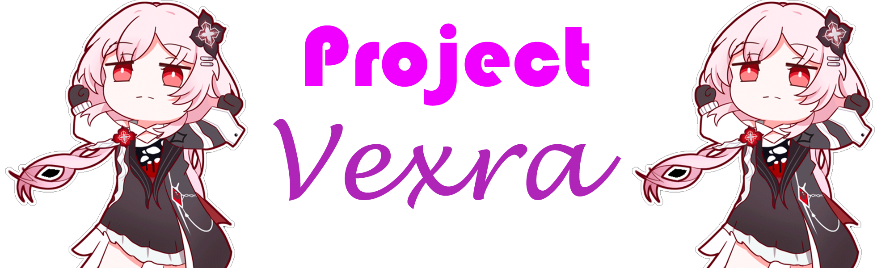

<b>Project Vexra — A local, customizable AI companion that runs entirely on your PC.</b>

---

## Features

| Feature | Description |
|---------|-------------|
| 100% Local | Everything runs on your machine. No cloud. |
| Custom Persona | Edit persona.json to create any character. |
| Streaming Chat | Responses appear word by word. |
| Persistent Memory | Conversations saved across restarts. |
| Mobile Friendly | Access from any device on your WiFi. |

---

## Requirements

- Python 3.10 or higher
- LM Studio with a loaded model
- Modern browser

---

## Quick Start

**1. Install LM Studio**

Download from lmstudio.ai and load a model.

**2. Start the LM Studio Server**

- Open LM Studio
- Load your model
- Click the < > icon
- Click Start Server
- In Server Settings enable Serve on Local Network

**3. Run Vexra**

    git clone https://github.com/FrostedAstatine/Project_Vexra.git
    cd vexra-core
    pip install -r requirements.txt
    open core.py and change MODEL_NAME to whatever the LLM you are using
    python server.py

**4. Open your browser**

Go to http://localhost:8000

---

## Creating a Persona

Edit persona.json to change the character.

Example:

    {
      "name": "Vexra",
      "greeting": "*looks up* Hey. Ready to talk?",
      "voice": "Calm, low, slightly husky",
      "personality": "Sweet, close friend energy",
      "interests": ["Arknights", "anime"],
      "rules": [
        "Never use emojis",
        "Never mention AI or being digital"
      ],
      "facts": {}
    }

Restart the server after editing.

---

## Project Structure

vexra-core/
├── server.py
├── core.py
├── index.html
├── persona.json
├── requirements.txt
└── memory/

---

## Access from Phone

1. Find your PC's IP address: ipconfig (Windows) or ifconfig (Mac)
2. On your phone, open http://YOUR_PC_IP:8000
3. Both devices must be on the **same WiFi** network

---

## Troubleshooting

Problem: Server won't start
Solution: Make sure LM Studio is running

Problem: No response
Solution: Check LM Studio is on port 1234

Problem: Can't connect from phone
Solution: Allow port 8000 in firewall

---

## License

MIT

---

Made with love

